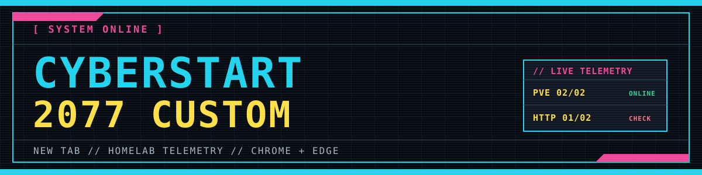
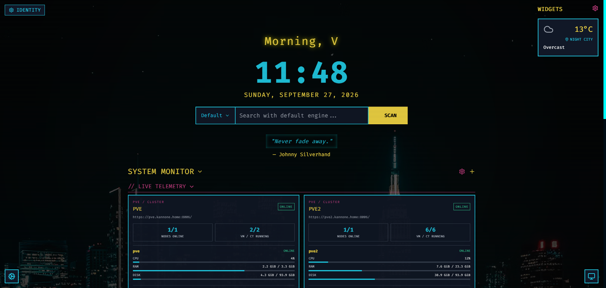
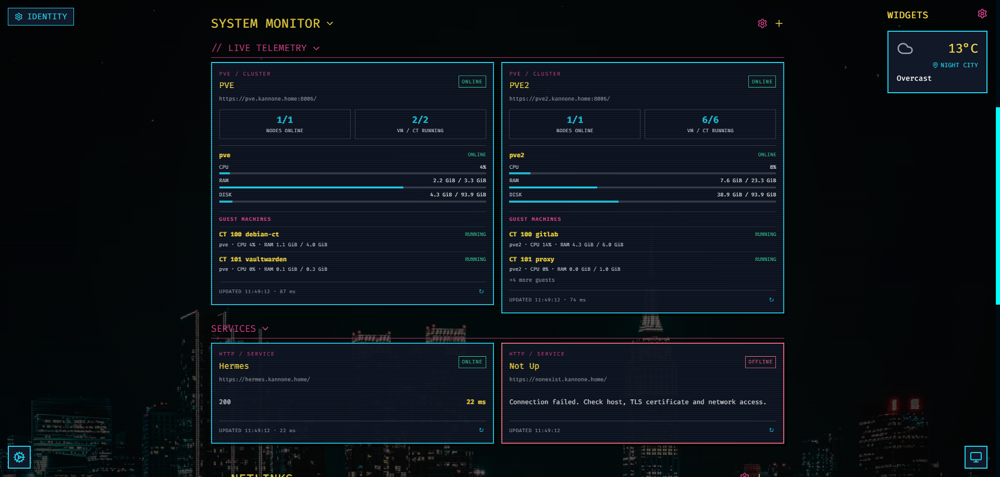

<p align="center">
  
</p>

<p align="center">
  <strong>A Night City inspired new tab with your homelab in view.</strong><br />
  Chromium Manifest V3 · Chrome &amp; Edge · Proxmox &amp; HTTP checks
</p>

<p align="center">
  <a href="#installation">Install</a> ·
  <a href="#screenshots">Screenshots</a> ·
  <a href="#system-monitor">System Monitor</a> ·
  <a href="#development">Development</a>
</p>

## Why I made this

I liked [TealLogic's original Cyberstart page](https://cyberstart.teallogic.com/), but I also wanted to see the state of my homelab whenever I opened a new tab. This fork keeps the original cyberpunk look and adds a configurable **System Monitor** for Proxmox nodes and HTTP services. I also adapted the extension to Chromium Manifest V3 and organized the JavaScript into editable source files.

The original design, fonts, and core features are TealLogic's work. See [Credits and license](#credits-and-license) for the original project and license details.

<p align="center">
  <a href="https://buymeacoffee.com/kannone"></a>
</p>

## Screenshots



*The new tab keeps the original atmosphere and places live telemetry between Search and Netlinks.*



*Proxmox resource cards and HTTP checks can be arranged in collapsible categories.*

## Features

| Area | What you get |
| --- | --- |
| **New tab** | The original Cyberstart layout, search, clock, weather, widgets, and Netlinks. |
| **System Monitor** | Multiple Proxmox cards with node and guest telemetry, plus HTTP checks that report online only for status `200`. |
| **Your layout** | Collapsible sections, draggable cards and categories, adjustable polling intervals, and the existing Terminal Display color themes. |
| **Portable settings** | Import/export for the page settings and System Monitor configuration, including cards, categories, order, and collapsed state. |

## Installation

### Chrome Web Store

**Store link: coming soon.** Once the listing is published, open it, select **Add to Chrome**, and open a new tab. The link will be added here after publication.

### From source

1. Clone or download this repository.
2. Open `chrome://extensions` or `edge://extensions`.
3. Turn on **Developer mode**.
4. Choose **Load unpacked** and select the repository folder containing `manifest.json`.
5. Open a new tab.

No development server or package install is needed. Settings are stored locally by the browser. After changing the source, rebuild and reload the extension from the extensions page.

> [!NOTE]
> This extension replaces the **New Tab** page. The browser's Home button and startup page are separate settings.

## System Monitor

Use **+** to add a card, then choose **Proxmox** or **HTTP Check** and its category. The **gear** enters edit mode: drag the six-dot handles to reorder cards or categories, edit or remove items, and add categories. Press **SAVE** when finished. Click **SYSTEM MONITOR**, **NETLINKS**, or a category title to collapse it. Hidden monitor cards pause their periodic checks.

### Proxmox

Enter the HTTPS base URL (for example, `https://pve.example.local:8006`), a token ID in the form `user@realm!token-name`, and its secret. The card reads `/api2/json/cluster/resources` to show nodes, CPU, RAM, disk, and VM/container status. Use a read-only token with `PVEAuditor` access to the nodes and guests you want to display. If privilege separation is enabled, grant the token the required permissions too.

### HTTP Check

Enter the complete URL, including any path or query string. The card sends a GET request and considers the service online only when the final response is `200`. Other status codes and connection errors appear as offline.

The default refresh interval is 60 seconds for Proxmox and 30 seconds for HTTP; each card can use a different interval. Chrome or Edge requests optional access to the configured host when you save a card. You can hide the entire dashboard under **Terminal Display → Display Elements → System Monitor**.

> [!WARNING]
> **Exported settings contain Proxmox API token secrets in plain text.** Keep the JSON backup private, do not share it, and delete it when you no longer need it. Secrets are also stored in the extension's local storage and are sent to the configured Proxmox server in the `Authorization` header. Use HTTPS and a read-only token.

**System Settings → Export Settings** includes monitor cards, categories, their order, and collapsed state. Import restores them; older backups without System Monitor data still work and leave the current dashboard untouched. After an import, you may need to grant host access again.

See the [Privacy Policy](PRIVACY_POLICY.md) for local storage and optional network requests.

<details>
<summary><strong>Certificate error: ERR_CERT_AUTHORITY_INVALID</strong></summary>

The browser must trust the server certificate. Optional host access does not override TLS checks, and the extension cannot bypass an untrusted certificate. Open the configured host and port in the browser and inspect the certificate. Prefer a trusted certificate, such as one issued through Proxmox ACME. For an internal CA, import only its verified **public** CA certificate into the browser or operating system trust store; never import the private key. Then reload the extension and refresh the card.

</details>

## Development

Edit files in `src/app/`, then build the JavaScript bundle with Node.js:

```powershell
node scripts/build.cjs
```

`src/vendor/` contains the bundled libraries. `assets/index-BYk5zujn.js` is generated and loaded by `index.html`, so edit the source files rather than that output. The original extension was distributed without source maps; some internal names remain short even after the source was separated. Run `node tests/monitoring.cjs` to check the monitor logic.

## Credits and license

Based on **Cyberpunk 2077 Themed Homepage 1.18** by **TealLogic**: [original homepage](https://cyberstart.teallogic.com/) · [Firefox add-on](https://addons.mozilla.org/en-US/firefox/addon/cyberpunk-2077-themed-homepage/).

This fork retains the original project's **Mozilla Public License 2.0**. See [LICENSE](LICENSE) and [THIRD_PARTY_NOTICES.md](THIRD_PARTY_NOTICES.md) for the license and source attribution. Keep those notices and the applicable source available when distributing modified versions.
